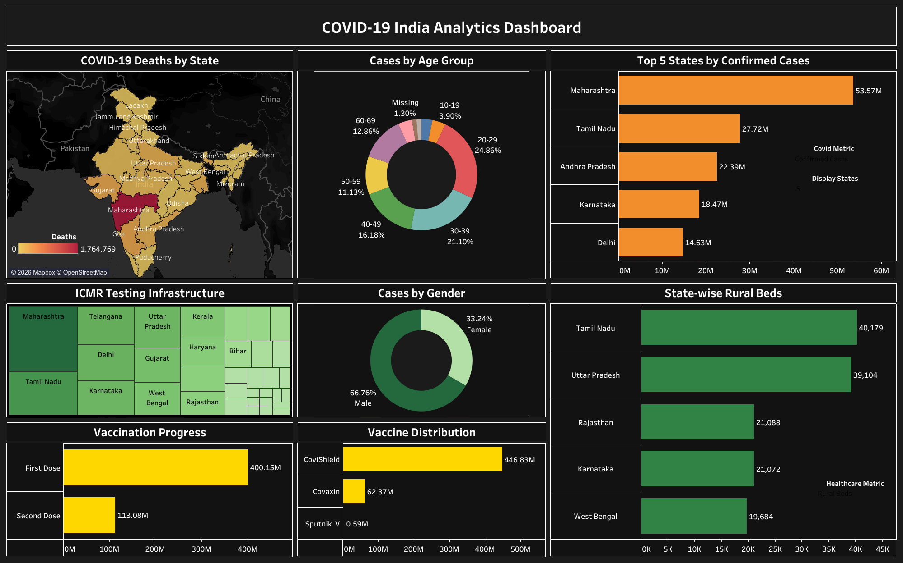

# COVID-19 India Analytics Dashboard

## Overview

This project presents an interactive Tableau dashboard analyzing COVID-19 trends across India using publicly available data. The dashboard highlights key metrics, state-wise comparisons, geographic distribution, and trend analysis to support effective data exploration.

The objective of this project is to demonstrate the use of Tableau for visualizing large-scale public health data and presenting insights through interactive dashboards.

---

## Dashboard Features

- Interactive dashboard filters
- KPI summary cards
- State-wise analysis
- Geographic mapping
- Trend analysis
- Recovery and confirmed case tracking
- Customized tooltips

---

## Tools & Technologies

- Tableau
- Data Visualization
- Dashboard Design
- Geographic Mapping

---

## Dashboard Preview

---

## Interactive Dashboard

[View Interactive Dashboard on Tableau Public](https://public.tableau.com/views/COVID-19IndiaAnalyticsDashboard/COVID-19IndiaAnalyticsDashboard?:language=en-US&:sid=&:redirect=auth&:display_count=n&:origin=viz_share_link)

---

## Repository Contents

- Tableau Workbook (.twbx)
- Dashboard Preview Image
- Project Documentation (README)

